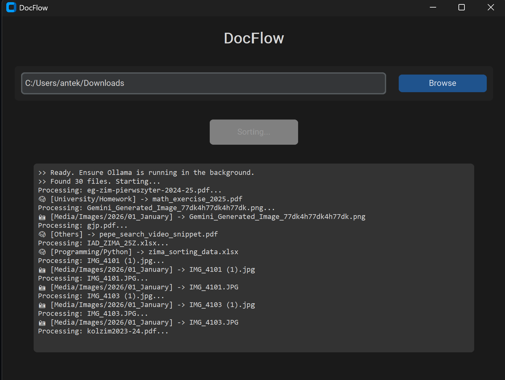

# Sortify AI - Local Intelligent File Organizer


**Sortify AI** is a privacy-first desktop application that automates file organization using a hybrid architecture of Static Rules and Local LLM (Llama 3).



## About The Project

Sortify AI solves the problem of digital clutter without compromising data privacy. Unlike cloud-based solutions, this tool processes sensitive documents (contracts, CVs, financial reports) **locally** on your machine.

It utilizes a **Waterfall Filtering System** to optimize performance:
1.  **Binary & Archives:** Instantly sorted by extension (O(1) complexity).
2.  **Media:** Organized chronologically (Year/Month) using file metadata.
3.  **Documents & Code:** Analyzed by AI (Llama 3) for semantic understanding and context-aware sorting.

## Key Features

* **Privacy First:** No data leaves your computer. Powered by the local `llama3` model.
* **Context-Aware Sorting:** The AI reads the content of PDFs, DOCX, PPTX, and Code files to determine the best category (e.g., classifying a Python script as `Programming/Python` or a Resume as `Career/CV`).
* **Hybrid Architecture:** Uses hardcoded rules for binary files to ensure speed, using AI only where necessary.
* **Smart Media Handling:** Automatically organizes photos and videos into `Year/Month` folders based on creation date.
* **Intelligent Renaming:** AI generates clean, descriptive filenames in `snake_case` based on document content.
* **Modern GUI:** Built with `CustomTkinter` for a clean, dark-mode interface with real-time logging and multithreading.

## How It Works (Logic Flow)

The system processes files in the following priority order:

1.  **Archives** (`.zip`, `.rar`) → Moved to `/Archives`.
2.  **Executables** (`.exe`, `.msi`) → Moved to `/Apps`.
3.  **Media** (`.jpg`, `.mp4`) → Metadata Extraction → Moved to `/Media/2024/05_May`.
4.  **Config Files** (`.yml`, `.log`) → Moved to `/Others`.
5.  **Documents** (`.pdf`, `.docx`, `.py`) → Text Extraction → **Llama 3 Analysis** → JSON Response → Moved to Semantic Category (e.g., `/Career/Contracts`).

## Installation & Usage

### Prerequisites
This application requires **Ollama** installed and running locally.
1.  Download Ollama from [ollama.com](https://ollama.com).
2.  Pull the Llama 3 model:
    ```bash
    ollama pull llama3
    ```

### Option A: Run the Executable
1.  Go to the **[Releases](../../releases)** section.
2.  Download the latest `SortifyAI.exe`.
3.  Run the application.

### Option B: Run from Source
1.  Clone the repository:
    ```bash
    git clone [https://github.com/YOUR_USERNAME/Sortify-AI.git](https://github.com/YOUR_USERNAME/Sortify-AI.git)
    cd Sortify-AI
    ```
2.  Install dependencies:
    ```bash
    pip install customtkinter ollama PyPDF2 python-pptx python-docx
    ```
3.  Run the app:
    ```bash
    python app_gui.py
    ```

## Tech Stack

* **Language:** Python 3
* **GUI:** CustomTkinter
* **AI Engine:** Ollama (Llama 3)
* **File Analysis:** `python-docx`, `python-pptx`, `PyPDF2`

## License

Distributed under the MIT License. See `LICENSE` for more information.
